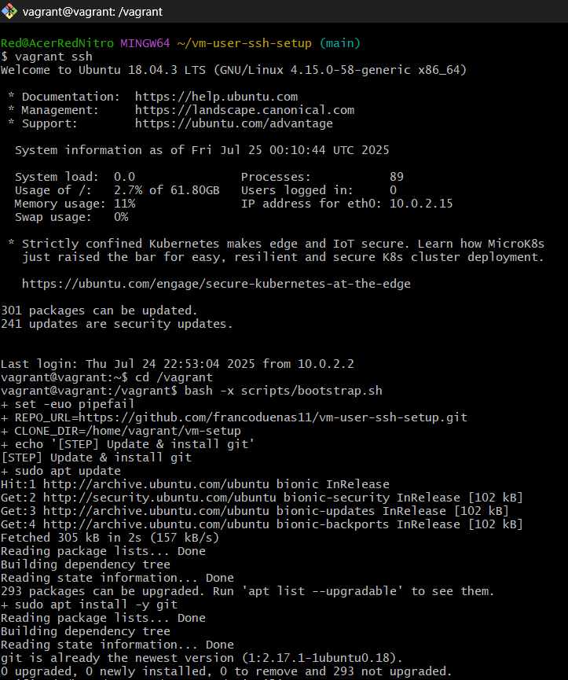
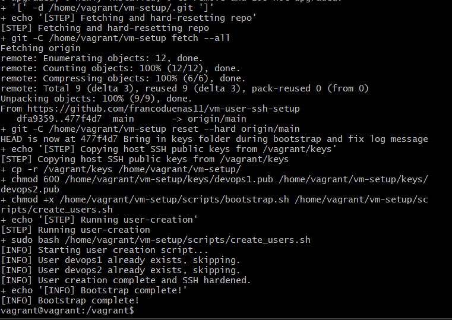

## vm-user-ssh-setup

Automate VM provisioning, user creation, and SSH hardening for DevOps demonstration and portfolio.

### Project Goal

Provision a Linux VM (local or cloud), automate user account setup, secure SSH access, and document the process in a GitHub repository. This project showcases core DevOps skills for potential employers: infrastructure-as-code, shell scripting, and secure configuration.

### Prerequisites

- **GitHub SSH Key**: Registered in your GitHub account and available as `<username>.pub` under `keys/`.
- **Environment**:
  - **Local VM**: Oracle VirtualBox & Vagrant installed.
  - **Cloud VM**: AWS CLI configured (with free-tier EC2 access) or Google Cloud SDK.

### Repository Structure

```
vm-user-ssh-setup/
├── infra/                  # (Optional) Terraform or CloudFormation configs
├── keys/                   # Public SSH keys for users (e.g., devops1.pub)
├── scripts/
│   ├── create_users.sh     # Script to create users and harden SSH
│   └── bootstrap.sh        # End-to-end setup: installs Git, clones repo, runs create_users.sh
├── docs/
│   └── architecture.md     # Architecture overview and flow diagram
└── README.md               # This documentation
```

### Usage

1. **On Host Machine** (Git Bash / Terminal):
   ```bash
   git clone https://github.com/<you>/vm-user-ssh-setup.git
   cd vm-user-ssh-setup/scripts
   chmod +x bootstrap.sh create_users.sh
   ```
2. **Start VM**:
   - **Local**: `vagrant up` (in project root) then `vagrant ssh`.
   - **Cloud**: Launch an Ubuntu EC2 instance and SSH in.
3. **Run Bootstrap**:
   ```bash
   ./bootstrap.sh
   ```
4. **Verify Results**:
   - Users `devops1` and `devops2` exist.
   - SSH password authentication is disabled.

### Professional Workflow

1. Create feature branches:
   ```bash
   git checkout -b feature/your-feature
   ```
2. Make changes, commit with clear messages:
   ```bash
   git add <files>
   git commit -m "Add descriptive message"
   ```
3. Push and open Pull Request:
   ```bash
   git push --set-upstream origin feature/your-feature
   ```
4. Merge via GitHub UI to demonstrate CI/CD readiness.

### Outcomes & Metrics

- **Automation**: Reduced manual user setup by 100% via `create_users.sh`.
- **Security**: Enforced SSH key authentication; eliminated password logins.
- **Reproducibility**: VM environment disposable with `vagrant destroy && vagrant up` or fresh EC2 launch.

## ✅ Demo Screenshots





*Highlights scripting, infrastructure, and secure DevOps practices.*

